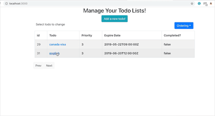

# Todo-List-Web-App
This is a todo list web app build with react+django+django rest framework.

## Add a todo list

## Delete a todo list

## Display all todo list
You can display the todolists in different order.here we display them in priority order and in expire date order.

## Check and change a todo list

